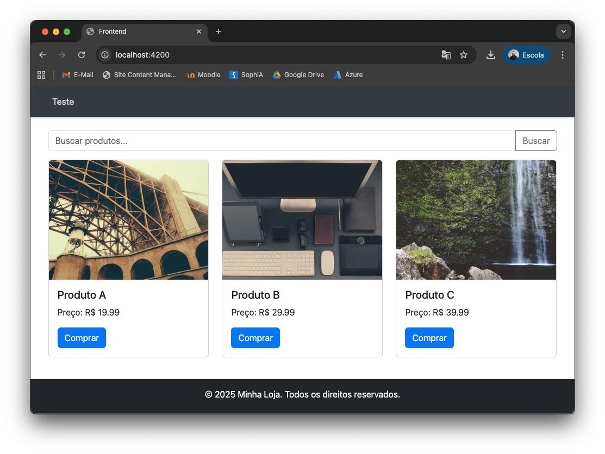

# Trabalho Final: Montagem de Aplicação com Componentes Angular

## Objetivo

O objetivo deste trabalho é aplicar os conceitos de componentização no Angular para construir a interface de um e-commerce simples. O projeto já contém os componentes, mas eles não estão conectados.

## Instruções Iniciais

1.  **Faça um Fork do Projeto:** Crie um "fork" deste repositório para a sua própria conta do GitHub.
2.  **Clone o seu Repositório:** Clone o repositório que você acabou de criar para a sua máquina local.
3.  **Instale as Dependências:** No terminal, dentro da pasta do projeto, execute `npm install`.

## Tarefa

Seu desafio é fazer a aplicação funcionar. A página está em branco e os componentes não se comunicam.

Você precisa fazer com que a tela principal seja montada e que uma lista de produtos apareça nela.

O resultado final deve ser visualmente semelhante ao arquivo `ENUNCIADO.png` que está na raiz do projeto.



**Dica:** Procure por comentários `TODO: Aluno` no código-fonte. Eles te darão pistas sobre onde você precisa atuar.

## Como Executar o Projeto

Para ver o resultado do seu trabalho, execute o seguinte comando no terminal:

```bash
ng serve
```

Abra seu navegador e acesse `http://localhost:4200/`.

**Bom trabalho!**
